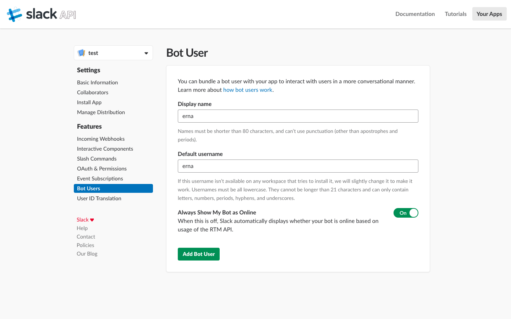

## Setup Slack App
Create a Slack app ([here](https://api.slack.com/slack-apps)).  
Assign a name and a workspace in the following steps.

After setting up the Slack app you have to add features like the slash command, interactive components and permissions.

Start with creating a bot user named `erna`.

Continue with the slash command, extend the root url of the future service with `/commands` and other options like the command name and a hint.

Continue with the interactive components which enables to ask for the current location.  
Extend the root url with the `/actions` path.

Finally grant the required permissions

- `users:read`
- `chat:write:bot`
- `mpim:write`
- `im:write`
- `commands`
- `bot`

and install the app to workspace.
Note the provided `Bot User OAuth Access Token` to deploy erna.

